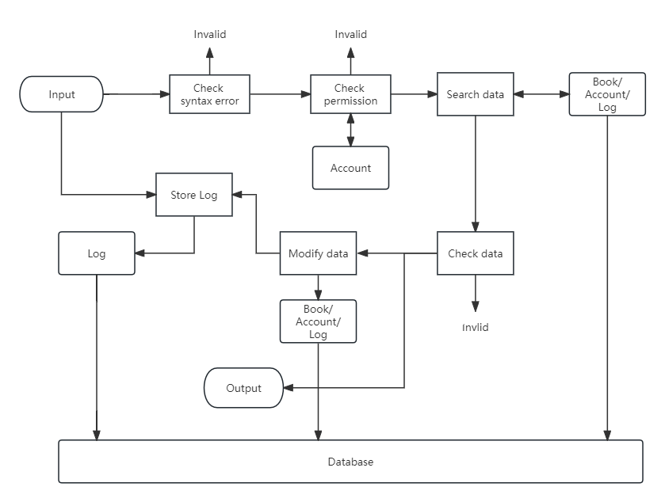

# Demand Analysis
## Control System
- receive input from command line or GUI
- check whether the input is valid and whether the user has permission
- interact with value and provide output
## Account System
- maintain account information
- provide interface to log in, register, change password
- maintain current user information, including permission level
## Book System
- maintain book information
- provide interface to search, buy, stock up, enter information, modify information
## Log System
- maintain log information, including time and income/outcome
- provide interface to check log by time
## Database
- maintain value, caching them or storing them in files
- provide interface to access value as std::set and search in a range
## 